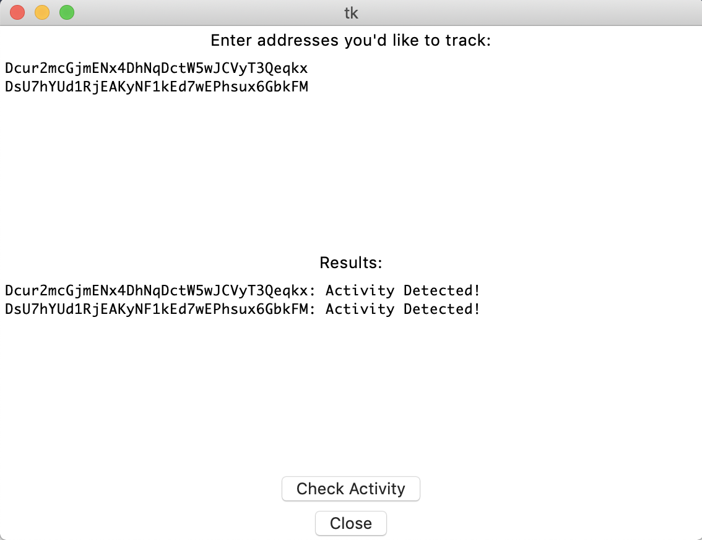

# AddressWatch

A simple, friendly GUI for tracking addresses for activity using python, Tkinter, and dcrdata's API.

## How

Just enter addresses you want to track and press "Check Activity".

## Why

I wanted to create something quick and easy to use to check if any addresses have received activity without loading up Decred's wallet software. I hope you find this useful and feel free to contribute!